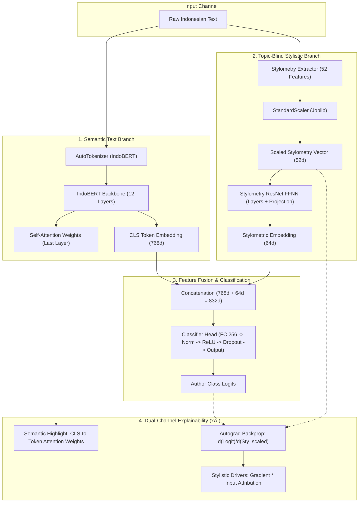

# StyloGuard: System Implementation & Model Integration

This document details the software architecture, model design, features, and Explainable AI (xAI) mechanisms of the StyloGuard system. 

---

## 🏗️ System Architecture Overview

StyloGuard uses a **hybrid Feature-Fusion Transformer** architecture that fuses semantic/contextual features with hand-crafted, topic-blind writing style metrics. This hybrid design mitigates "topic-leakage" (where models classify the *subject* rather than the *author*) and provides high-fidelity, dual-channel explainability.



---

## 🧠 Model Architecture & Layers

The core model is implemented in `FeatureFusionTransformer` ([feature_fusion_transformer.py](file:///d:/StyloGuard%20(Branch)/StyloGuard/backend/app/model/feature_fusion_transformer.py)), wrapping the `indobenchmark/indobert-base-p1` model.

### 1. Semantic Text Branch
*   **Backbone**: IndoBERT-Base (12-layer Transformer, 768 hidden dimensions).
*   **Output representation**: The `[CLS]` token embedding (shape: `[batch_size, 768]`) represents the overall semantic context of the document.

### 2. Stylistic Branch
*   **Input**: A 52-dimensional vector of hand-crafted stylometric features.
*   **Fully-Connected Neural Network (FFNN)**:
    *   **Linear Projection 1**: Maps 52 features to 64 dimensions, followed by LayerNorm, ReLU, and 30% Dropout.
    *   **Linear Projection 2**: Maps 64 dimensions to 64 dimensions, followed by LayerNorm, ReLU, and 30% Dropout.
    *   **Residual connection**: The outputs of both projection layers are summed (`s1 + s2`) to form a robust 64-dimensional stylistic fingerprint.

### 3. Classification Head
*   **Concatenation**: Fuses the semantic representation and the stylistic fingerprint (`768d + 64d = 832d`).
*   **Final Layer**: A multi-layer perceptron (Linear `832 → 256` -> LayerNorm -> ReLU -> Dropout 30% -> Linear `256 → num_classes`) outputs raw prediction logits.

---

## 📊 Stylometric Feature Extraction

Writing features are calculated by [stylometry_extractor.py](file:///d:/StyloGuard%20(Branch)/StyloGuard/backend/app/model/stylometry_extractor.py), which produces a **52-dimensional** vector.

1.  **Lexical & Structural Metrics (24 features)**:
    *   Length metrics: Word, sentence, and paragraph counts; average lengths.
    *   Sentence length variance (captures writing rhythm).
    *   Lexical diversity (Type-Token Ratio - TTR).
    *   Punctuation densities: commas, periods, question marks, exclamation marks, dashes, and colons/semicolons.
    *   Casing metrics: uppercase ratios and digital/numerical ratios.
    *   Indonesian suffixes: frequency of morphology markers `**-nya**`, `**-lah**`, and `**-kah**`.
    *   Stopword ratio: calculated using a built-in static hash of 383 Indonesian stopwords (Tala 2003) to eliminate NLTK installation dependencies.

2.  **Function Word Ratios (28 features)**:
    *   Tracks frequencies of topic-blind Indonesian particles, prepositions, and conjunctions (e.g. *yang*, *dan*, *di*, *ke*, *dari*, *dengan*, *untuk*, *pada*, *ini*, *itu*, *karena*, etc.) which indicate subconscious writing style.

### Normalization
Features are normalized using a pre-trained Scikit-Learn `StandardScaler` loaded from `standard_scaler.joblib`. This maps raw metrics to zero-mean unit-variance vectors so that the neural network weights scale correctly.

---

## 💎 Dual-Channel Explainable AI (xAI)

StyloGuard features a state-of-the-art explainability engine implemented in the `ModelManager.predict` method ([model_manager.py](file:///d:/StyloGuard%20(Branch)/StyloGuard/backend/app/model/model_manager.py)):

### 1. Semantic Explainability (Self-Attention Highlights)
To show which parts of the text drove the classifier's contextual analysis:
*   We extract the self-attention tensor from the **last transformer layer** of IndoBERT (shape: `[num_heads, seq_len, seq_len]`).
*   We average the weights across all heads to produce a unified attention matrix.
*   We slice the averaged attention weights corresponding to the `[CLS]` token (index 0) to get its attention over all other tokens in the sequence.
*   We filter out special tokens (like `[PAD]`, `[CLS]`, `[SEP]`), strip subword markers (`##`), and return the top 10 unique words with the highest attention weights for HTML highlighting.

### 2. Stylistic Explainability (Backpropagation Attribution)
To find which stylistic features had the most positive or negative influence on the prediction:
*   We run the forward pass through the backend.
*   We isolate the logit score corresponding to the predicted class $y_{pred}$.
*   We run backpropagation on the predicted logit back to the scaled input stylometric tensor ($x_{sty}$) using PyTorch's autograd engine:
    $$\text{gradient} = \frac{\partial y_{pred}}{\partial x_{sty}}$$
*   We compute the true feature attribution using the **Gradient $\times$ Input** formula:
    $$\text{Attribution} = \text{gradient} \times x_{sty}$$
*   This yields positive values (features that pushed the model *toward* this classification) and negative values (features that pulled the model *away* from this classification).
*   The top 10 contributing features are sorted by absolute attribution and displayed on the frontend chart.

---

## 🔌 API & Integration Workflow

The FastAPI server initializes and serves the model using the `ModelManager` singleton.

```
                  ┌────────────────────────┐
                  │   FastAPI Startup      │
                  └───────────┬────────────┘
                              │ Lifespan hook
                              ▼
                  ┌────────────────────────┐
                  │   ModelManager.load()  │
                  └───────────┬────────────┘
                              │ Resolves paths, loads Torch 
                              │ weights, scaler, & tokenizers
                              ▼
                 ┌──────────────────────────┐
                 │ API Endpoint: /predict   │
                 └────────────┬─────────────┘
                              │ Payload: {text}
                              ▼
                 ┌──────────────────────────┐
                 │ Extract Stylometrics &   │
                 │ Tokenize input text      │
                 └────────────┬─────────────┘
                              │
                              ▼
                 ┌──────────────────────────┐
                 │ Execute Forward Pass &   │
                 │ Run Autograd Backprop    │
                 └────────────┬─────────────┘
                              │
                              ▼
                 ┌──────────────────────────┐
                 │ Format Probabilities,    │
                 │ xAI Tokens & Driver Maps │
                 └────────────┬─────────────┘
                              │ Response
                              ▼
                   ┌──────────────────────┐
                   │    Web Frontend UI   │
                   └──────────────────────┘
```

1.  **Initialization**: At startup, `app/main.py` invokes `ModelManager.get().load()`. It loads PyTorch weights to CPU/GPU, loads the joblib scaler, and initializes the IndoBERT tokenizer. If any file is missing, the backend defaults to a non-blocking configuration (returning 503 for inference).
2.  **Inference execution**: The `/predict` router receives text, processes it synchronously, calculates self-attention and gradients, and returns a structured JSON payload containing the class probabilities, top attention tokens, and top stylometric feature attributions.
